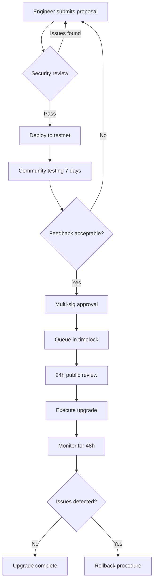

# Contract Upgrade Strategy

## Overview

TrustForge contracts follow an immutable-by-default deployment model with explicit upgrade authorization when needed. This document outlines the complete upgrade strategy, including governance, testing, and rollback procedures.

## Upgrade Philosophy

### Immutability First
- Contracts are deployed as immutable WASM code
- Upgrades are **opt-in** and require explicit governance approval
- No automatic upgrades or proxy patterns by default
- Storage keys are stable across upgrades (validated by fingerprint tests)

### When to Upgrade vs Migrate

| Scenario | Recommended Approach |
|----------|---------------------|
| **Bug fix** (no state changes) | Upgrade existing contract |
| **Parameter adjustment** | Use admin setter functions (no upgrade needed) |
| **New features** (backward compatible) | Upgrade existing contract |
| **Breaking storage changes** | Deploy new contract + migrate state |
| **Critical security fix** | Emergency upgrade via timelock |
| **Major protocol redesign** | Deploy new contracts + deprecate old |

## Upgrade Mechanisms

### 1. Direct Admin Upgrade (Low-Risk Changes)

For non-critical upgrades where immediate deployment is acceptable:

```rust
// trustforge_bond upgrade flow
pub fn propose_upgrade(e: Env, proposer: Address, new_impl: Address) -> u64
pub fn approve_upgrade(e: Env, approver: Address, proposal_id: u64)
pub fn execute_upgrade(e: Env, executor: Address, proposal_id: u64)
```

**Process:**
1. Proposer submits new implementation address
2. Approver (different from proposer) approves the upgrade
3. Executor deploys the upgrade
4. Event `upgrade_executed` emitted with new implementation

**Safety:**
- Requires dual authorization (proposer ≠ approver)
- Storage layout must be compatible
- DataKey fingerprints must match (CI validates)

### 2. Timelock Upgrade (High-Risk Changes)

For critical upgrades requiring community review period:

```bash
# 1. Deploy new implementation
NEW_IMPL=$(soroban contract deploy --wasm new_contract.wasm ...)

# 2. Queue in timelock (24h minimum delay)
soroban contract invoke --id $TIMELOCK -- queue_operation \
  --target $BOND_CONTRACT \
  --payload <upgrade_payload> \
  --delay 86400

# 3. Wait for timelock expiry
# ... 24 hours pass ...

# 4. Execute from timelock
soroban contract invoke --id $TIMELOCK -- execute_operation \
  --operation_id <id>
```

**Use Cases:**
- Core contract logic changes
- Economic parameter modifications
- Access control restructuring
- Integration with new contracts

### 3. Emergency Upgrade (Critical Security Fixes)

For immediate response to active exploits:

**Prerequisites:**
- Multi-sig approval from threshold of signers
- Emergency mode activated
- Incident documented with CVE if applicable

**Process:**
1. Activate emergency mode (requires multi-sig)
2. Pause affected contracts
3. Deploy patched implementation
4. Execute emergency upgrade (bypasses timelock)
5. Verify fix and resume operations
6. Post-mortem and transparency report

**Safeguards:**
- All emergency upgrades create immutable audit log
- `emergency_upgrade_executed` event with justification
- Requires governance + admin dual-auth
- Community notification within 1 hour

## Storage Migration

### Compatible Upgrades (No Migration Needed)

Safe upgrades that preserve storage layout:
- ✅ Adding new functions
- ✅ Adding new storage keys (not renaming existing)
- ✅ Changing function logic (same inputs/outputs)
- ✅ Improving gas efficiency

### Incompatible Upgrades (Migration Required)

Upgrades requiring state migration:
- ❌ Renaming DataKey variants
- ❌ Changing field types in stored structs
- ❌ Removing required fields
- ❌ Changing storage tier (persistent ↔ temporary)

**Migration Process:**

```rust
// Step 1: Add migration function to new implementation
pub fn migrate_storage_v1_to_v2(e: Env, admin: Address) {
    admin.require_auth();
    
    // Read old format
    let old_data: OldStruct = e.storage().persistent().get(&DataKey::OldFormat)?;
    
    // Transform to new format
    let new_data = NewStruct {
        field_1: old_data.field_1,
        field_2: old_data.field_2,
        new_field_3: default_value(),
    };
    
    // Write new format
    e.storage().persistent().set(&DataKey::NewFormat, &new_data);
    
    // Remove old key
    e.storage().persistent().remove(&DataKey::OldFormat);
    
    e.events().publish(("storage_migrated", "v1_to_v2"), ());
}
```

**Deployment Steps:**
1. Deploy new implementation with migration function
2. Execute upgrade proposal
3. Call migration function
4. Verify new storage format
5. Index `storage_migrated` events

### Storage Key Stability

**DataKey Fingerprint Tests** (in every contract):
```rust
// tests/datakey_fingerprint.rs
// Pins XDR encoding of each DataKey variant
// Any change that moves a key → CI fails
```

**Rules:**
- ❌ Never rename DataKey variants in production
- ❌ Never change field types in DataKey enums
- ✅ Add new variants (append only)
- ✅ Use version suffixes for migrations (`BondV2`, `AttestationV2`)

## Testing Upgrades

### Pre-Upgrade Testing Checklist

Before proposing any upgrade to testnet or mainnet:

- [ ] **Unit tests pass** - All existing tests green
- [ ] **Integration tests updated** - New functionality covered
- [ ] **Property-based tests** - Invariants maintained
- [ ] **Fuzz tests** - No panics on random inputs
- [ ] **Gas benchmarks** - Performance within acceptable range
- [ ] **WASM size** - Under 64KB limit
- [ ] **DataKey fingerprints** - No storage key collisions
- [ ] **Storage migration** - If applicable, tested on testnet snapshot
- [ ] **Event indexing** - New events compatible with indexer
- [ ] **Cross-contract calls** - Integrations still work

### Testnet Simulation

Always test upgrade flow on testnet first:

```bash
# 1. Deploy current production version to testnet
# 2. Create test bonds and state
# 3. Deploy new implementation
# 4. Execute upgrade proposal
# 5. Verify:
#    - Existing bonds still accessible
#    - New functions work
#    - Events emit correctly
#    - Cross-contract calls succeed
# 6. Run integration test suite against upgraded testnet
```

### Mainnet Rehearsal

Before mainnet upgrade:

```bash
# 1. Fork mainnet state to local test environment
# 2. Replay upgrade procedure on fork
# 3. Verify all critical paths
# 4. Document any unexpected behavior
# 5. Update runbook with lessons learned
```

## Rollback Procedures

### Scenario 1: Upgrade Not Yet Executed

**If proposal in timelock:**
```bash
# Cancel the queued operation (requires admin)
soroban contract invoke --id $TIMELOCK -- cancel_operation \
  --admin $ADMIN \
  --operation_id $OP_ID
```

### Scenario 2: Upgrade Executed, Issue Discovered

**Within 24 hours of upgrade:**

1. **Immediate Response**
   ```bash
   # Pause contract to stop new interactions
   soroban contract invoke --id $BOND -- propose_pause \
     --proposer $SIGNER_1 --action pause
   # (Repeat until threshold reached)
   ```

2. **Deploy Rollback**
   ```bash
   # Deploy previous working implementation
   ROLLBACK_IMPL=$(soroban contract deploy \
     --wasm previous_version.wasm ...)
   
   # Emergency upgrade to previous version
   soroban contract invoke --id $BOND -- propose_upgrade \
     --proposer $ADMIN --new_impl $ROLLBACK_IMPL
   ```

3. **State Reconciliation**
   - If storage was modified, may need manual reconciliation
   - Export affected state before rollback
   - Reapply valid transactions after rollback
   - Compensate affected users if necessary

4. **Communication**
   - Immediate status page update
   - Detailed post-mortem within 72 hours
   - Compensation plan if funds affected

### Scenario 3: Irreversible Upgrade

If rollback impossible (storage migration already executed):

1. **Deploy fixed version forward**
2. **Migrate state to correct format**
3. **Compensate affected users from treasury**
4. **Update documentation and post-mortem**

## Governance Process

### Upgrade Proposal Requirements

All non-emergency upgrades must include:

1. **Proposal Document**
   - Summary of changes
   - Justification (bug fix, feature, optimization)
   - Breaking changes (if any)
   - Migration plan (if storage affected)
   - Rollback plan

2. **Code Diff**
   - Link to PR with full diff
   - Highlighted critical changes
   - Test coverage report

3. **Audit (for major changes)**
   - Security review completed
   - Audit report published
   - Findings addressed or acknowledged

4. **Timeline**
   - Testnet deployment date
   - Mainnet proposal date
   - Execution date (after timelock)
   - Expected downtime (if any)

### Approval Workflow



**Approval Thresholds:**
- **Minor upgrades**: 2-of-3 multi-sig
- **Major upgrades**: 3-of-5 multi-sig + community notice
- **Emergency upgrades**: 3-of-5 multi-sig + incident documentation

## Versioning Strategy

### Semantic Versioning

Contracts follow semver after 1.0.0 release:

- **1.0.x** - Patch: Bug fixes, no API changes
- **1.x.0** - Minor: New features, backward compatible
- **x.0.0** - Major: Breaking changes, migration required

### Version Metadata

Each contract stores version info:

```rust
pub const VERSION: &str = "1.2.3";
pub const COMPATIBLE_FROM: &str = "1.0.0";

pub fn get_version(e: Env) -> (String, String) {
    (
        String::from_str(&e, VERSION),
        String::from_str(&e, COMPATIBLE_FROM)
    )
}
```

### Compatibility Matrix

| Current | Can Upgrade To | Migration Required |
|---------|----------------|-------------------|
| 1.0.x | 1.0.y | No |
| 1.0.x | 1.1.0 | No |
| 1.0.x | 2.0.0 | Yes |
| 1.5.x | 1.6.0 | No |
| 1.5.x | 2.0.0 | Yes |

## Monitoring & Alerts

### Post-Upgrade Metrics

Monitor for 48 hours after upgrade:

- **Transaction success rate** - Should remain >99%
- **Gas costs** - Should not increase significantly
- **Event emission** - All expected events firing
- **Storage operations** - No unexpected reads/writes
- **Cross-contract calls** - Integration points healthy
- **Error codes** - No new error patterns

### Alert Conditions

Set up alerts for:
- 🚨 Transaction failure rate >1%
- 🚨 Gas spike >50% vs baseline
- 🚨 Storage read errors
- 🚨 Panic events
- ⚠️ Unusual slashing activity
- ⚠️ Large withdrawals (possible exploit)

## Best Practices

### DO ✅

- Test exhaustively on testnet first
- Use timelock for major changes
- Document all breaking changes
- Maintain backward compatibility when possible
- Version all storage keys
- Keep rollback WASM artifacts
- Communicate transparently with community
- Create detailed runbooks
- Conduct post-mortems

### DON'T ❌

- Deploy directly to mainnet without testnet verification
- Skip DataKey fingerprint validation
- Rename storage keys in place
- Upgrade during high-traffic periods
- Bundle unrelated changes in one upgrade
- Ignore test failures
- Rush emergency upgrades without review
- Delete previous WASM versions

## Emergency Contacts

**Upgrade Incidents:**
- Engineering Lead: ops@trustforge.io
- Security Team: security@trustforge.io
- PagerDuty: +1-XXX-XXX-XXXX (to be configured)

**Escalation Path:**
1. On-call engineer (0-15 min)
2. Engineering lead (15-30 min)
3. Security team (30-60 min)
4. Executive team (1-2 hours)

## Historical Upgrades

Track all upgrades here:

| Date | Contract | From | To | Type | Reason | Status |
|------|----------|------|-----|------|--------|--------|
| TBD | trustforge_bond | 0.1.0 | 1.0.0 | Production | Initial mainnet deployment | Planned |
| TBD | trustforge_bond | 1.0.0 | 1.0.1 | Patch | Bug fix #XXX | Planned |

## Additional Resources

- [Testnet Deployment Guide](DEPLOYMENT.md)
- [Mainnet Deployment Guide](MAINNET_DEPLOYMENT.md)
- [Security Audit Report](../SECURITY_AUDIT.md)
- [Storage Key Documentation](STORAGE_KEYS.md)
- [DataKey Fingerprint Guide](datakey-fingerprint.md)

---

**Last Updated**: January 2026  
**Maintainer**: TrustForge Engineering Team
